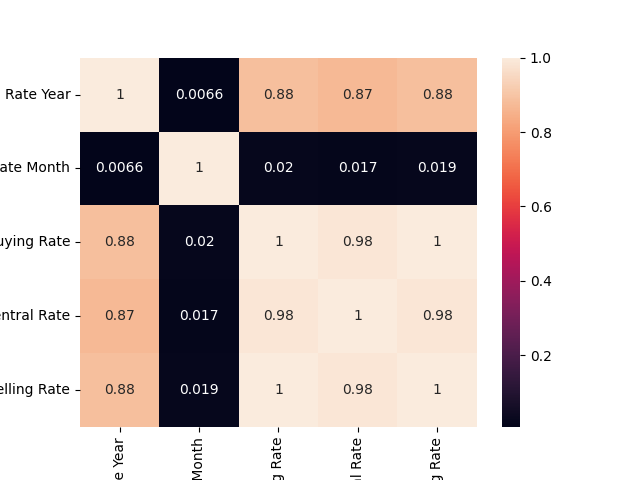

# Dollar to Naira Exchange Rate Prediction

## Project Objectives
This project aims to predict the exchange rate between the US Dollar and the Nigerian Naira. Three different machine learning models were built to predict the exchange rate: linear regression, Support Vector Machine (SVM), and Artificial Neural Network (ANN). The models were trained and evaluated using historical exchange rate data from 2001 to 2022.

## Project Structure
- `assets/` - Holds plot images obtained during the study.
- `datasets/` - Holds the dataset used in the study.
- `production/` - Holds Django files that enables prediction in a live environment
- `production/artifcats/` - Holds contents of the compiled model.
- `production/templates` - Holds html files used in the web environment.
- `production/static` - Holds CSS files used in the web environment.
- `production/RequestHandler` - Holds files that interface with the prediction functions.

## Generating model artifacts
To run the notebook, you need to have Visual Studio Code or Jupyter Notebook installed on your computer. On Visual Studio Code, use the `Jupyter` extension from Marketplace to power up a kernel.

### Installing dependencies
The following packages are required to run the notebook:

- pandas
- matplotlib
- sklearn
- keras

You can install all of the required packages by running the following command in your terminal:

```sh
pip install -r requirements.txt
```

## Collecting metrics
The performance of each model was evaluated using the R2 Score metric. The higher the score, the better the model's performance.

The following figures show the actual exchange rates vs. predicted exchange rates for each model:

- Relationship across variables:


- Linear Regression:


- Support Vector Machine:


- Artificial Neural Network:


## Making Real-time Predictions
To enable real-time predictions, the model artifacts are served in an environment powered by Django and Jinja's Template engine. To deploy the web environment locally, switch to `production` folder and start the web server:

```sh
cd production
python manage.py runserver
```
Server Log:


In a browser window, open the specified address (http://127.0.0.1:8000), specify the model to be used for prediction and passing the value to be predicted for


And there you have a successful prediction!

## Conclusion
Overall, the best model for predicting the dollar to naira exchange rate was the Artficial Neural Network (ANN) model, with a R2 score of 96.66%. The Support Vector Machine (SVM) model had a R2 score of 95.50%, while the linear regression model had a a R2 score of 78.92%